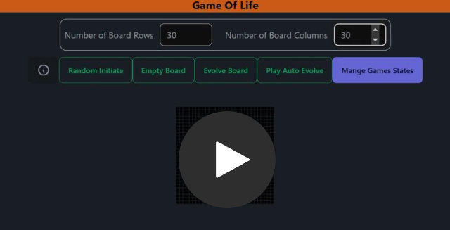

##    Game Of Life - Home Assignment

## Requirements

The requirements for this project can be found in the document: [Home Assignment.pdf](docs/Home%20Assignment.pdf)

## Setup The Project

1. Clone the repository
   ```bash
   git clone https://github.com/naor88/game-of-life.git
   cd game-of-life
   ```
2. Install the dependencies

   ```bash
   npm install
   ```

3. Build
   ```bash
   npm run build
   ```
4. Test

   ```bash
   npm run test
   ```

5. Run
   ```bash
   npm run start
   ```

## Demo

Check out the live demo: [Game Of Life](https://game-of-life-nextjs.netlify.app)

## Record demo from the project:

[](https://share.vidyard.com/watch/tguHY6jVbEsThzJgvuouko?)

## Technologies Used

- Next.js: A React framework for building server-side rendered applications.
- React: A JavaScript library for building user interfaces.
- TypeScript: A typed superset of JavaScript that compiles to plain JavaScript.
- TailwindCSS: A utility-first CSS framework for rapidly building custom user interfaces.
- daisyUI: A set of components and utility classes for TailwindCSS.
- better-sqlite3: A fast, simple, and efficient SQLite3 module for Node.js
- jest: JavaScript testing framework designed to ensure correctness of any JavaScript codebase.
